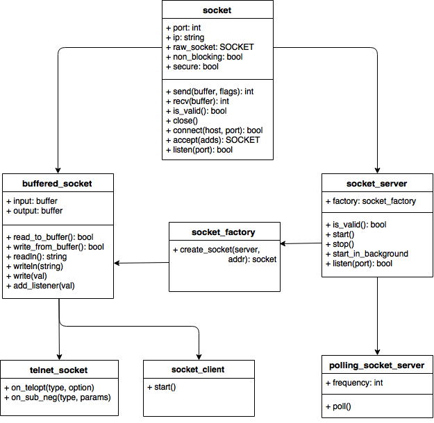

libarg3net
==========

[](https://travis-ci.org/ryjen/arg3net)
[](https://coveralls.io/github/ryjen/arg3net?branch=master)
[](http://ryjen.mit-license.org)

A c++11 networking library.

A good working example is [Yahtsee](http://github.com/ryjen/yahtsee).

Building
========

You can use [cmake](https://cmake.org) to generate for the build system of your choice.

```bash
mkdir debug; cd debug
cmake -DCMAKE_BUILD_TYPE=Debug ..
make
make test
```

options supported are:

    -DCODE_COVERAGE=ON   :   enable code coverage using lcov
    -DMEMORY_CHECK=ON    :   enable valgrind memory checking on tests
    -DWITH_CURL=ON       :   enable curl usage for http client
    -DWITH_SSL=ON        :   enable openssl usage for non-curl http client


Model
=====



Usage
=====

There are two ways to implement a server.

#### Method A
1) subclass a socket and implement callback to perform an action on input/output

2) subclass a socket_factory to create the new socket type

3) start a server with the factory

#### Method B

1) subclass a socket listener to perform an action on input/output

2) subclass a socket_factory to add the listener to a socket

3) start a server with the factory

Examples
========

### Implement a factory and a listener

```c++
/**
 * create connections and listen to connection events
 */
class example_factory : public arg3::net:socket_factory, public arg3::net::buffered_socket_listener,
                        public enable_shared_from_this<example_factory>
{
public:
    /* creates a client on a new connection and adds a listener */
    socket_factory::socket_type create_socket(const socket_factory::server_type &server, 
                                              SOCKET sock, const sockaddr_in &addr) {
      	if (server->is_non_blocking()) {
            auto sock = std::make_shared<buffered_socket>(sock, addr);

            sock->add_listener(shared_from_this());

            return sock;
        }

        auto client = std::make_shared<socket_client>(sock, addr);

        client->add_listener(shared_from_this());

        // start the read/write loop
        client->start();

        return client;
  	}

    void on_did_read(const socket_type &sock) {
      cout << "read from client socket" << endl;
    }

    void on_did_write(const socket_type &sock) {
      cout << "wrote to client socket" << endl;
    }

    void on_connect(const socket_type &sock) {
      cout << "client socket connected" << endl;
    }
};
```

#### Run a server in the background

```c++
int main() {
    /* create a factory */
    std::shared_ptr<example_factory> mySocketFactory = std::make_shared<example_factory>();

    /* create a server */
    arg3::net::socket_server example_server(1337, mySocketFactory);

    /* start running */
    example_server.start_in_background();

    /* wait till done */
    while(example_server.is_valid()) {
        sleep(1);
    }

    return 0;
}

```


#### Run an polling server in the foreground

```c++
int main() {
    /* create a factory */
    std::shared_ptr<example_factory> mySocketFactory = std::make_shared<example_factory>();

    /* create a server */
    arg3::net::polling_socket_server example_server(1337, mySocketFactory);

    /* start running */
    example_server.start();

    return 0;
}

```

Other
=====

**http_client** is a very basic implementation of a HTTP/Rest client:

```c++

http_client api("api.somehost.com");

// get some resource
api.get("version/resource/id");

auto response = api.response();

cout << response.code() << ": " << response << endl;

// post some resource
api.post("version/resource")

// etc
```

TODO
====

* more socket rfc implementations (HTTP, SMTP, WebSockets)
* more testing
